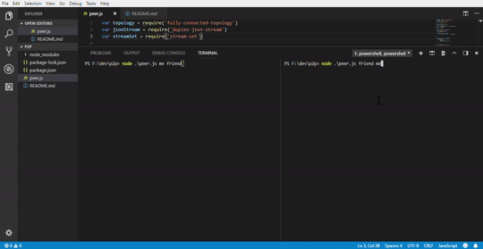

# p2p
Chat Peer to Peer

## Install Lib require
```
npm install
```

## Run
* terminal
```
node peer.js me friend
```
* Another terminal
```
node peer.js friend me
```
## Demo


## Reference
* [Mathias-buus](https://www.elastic.co/videos/how-to-write-a-p2p-chat-app-in-nodejs-by-mathias-buus)
